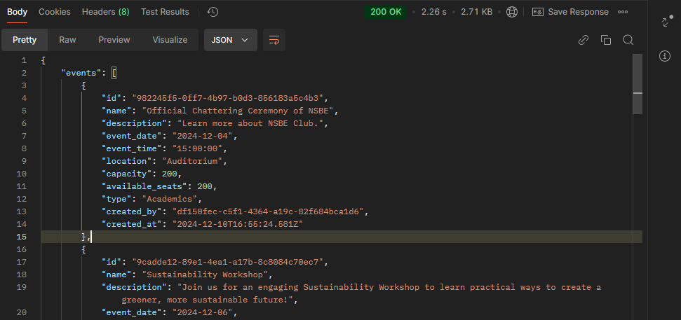
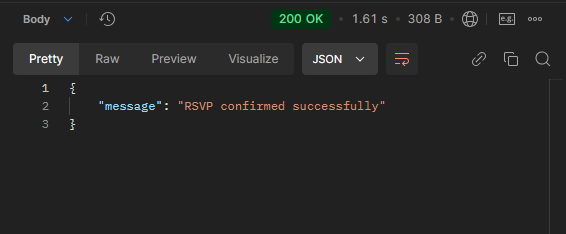
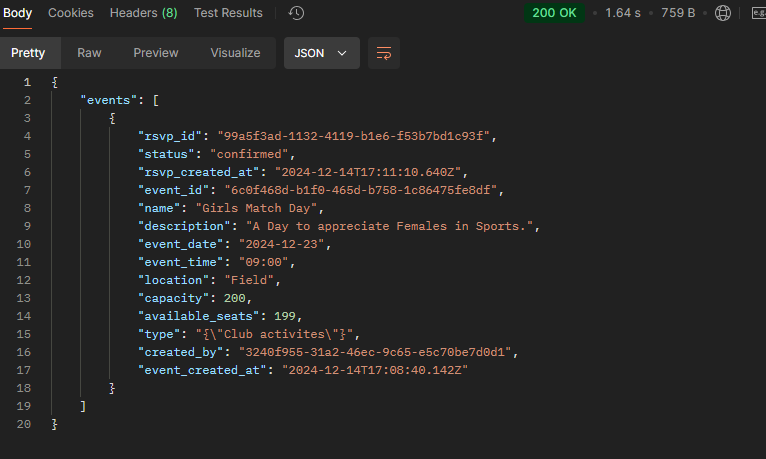

# Campus Event Management System Backend

This is the backend of a campus event management system. It's built with Node.js and Supabase (PostgreSQL database) to handle user authentication, event creation, and RSVP management.

## What You Can Do with It
- User Sign Up and Login: Users can create accounts and log in with secure tokens.
- Create and Manage Events: Admins can create events, and everyone can see them.
- RSVP to Events: Users can RSVP to events, and the system will track available seats.
- Roles for Admin and Users: Different permissions for admins and regular users.

## Tools We Use
- Node.js: JavaScript server.
- Express.js: Web framework to build our API.
- Supabase (PostgreSQL): Database where we store users and events data.
- bcryptjs: Used for hashing passwords.

## Getting Started

### What You Need
- Install Node.js and npm.
- Have Supabase set up (see below for details).

### How to Set It Up
1. Clone the repo to your computer:
   ```bash
   git clone https://github.com/Uche-UkahChimzyterem/Campuss-Event-Management-System-Backend
   cd your-repo/Nodejs-postgress
   ```
2. Install the required libraries:
   ```bash
   npm install
   ```
3. Set up environment variables (explained below).

4. Start the server:
   ```bash
   npm start
   ```

### Supabase Setup
1. Sign up for Supabase (if you haven't already): [Supabase](https://supabase.com/).
2. Create a new project in Supabase and get your SUPABASE_URL and SUPABASE_API_KEY from the project settings.
3. In your project folder, create a `.env` file and add:
   ```bash
   SUPABASE_URL=your_supabase_url
   SUPABASE_API_KEY=your_supabase_api_key
   JWT_SECRET=your_secret_key_for_tokens
   JWT_EXPIRES=expiration_time_for_tokens
   PORT=port_number_for_the_server
   ```

## API Endpoints

### For Authentication

#### Register User
- Method: `POST /api/auth/register`
- Request Body:
  ```json
  {
    "name":"Uche",
    "email":"uche@example.com",
    "password":"test1",
    "role":"user",
    "preferences":["Club activites"]
}
  ```
- Postman Screenshot:
  
- Response:
  ```json
  {
    "message": "User registered successfully "
  }
  ```

#### Login User
- Method: `POST /api/auth/login`
- Request Body:
  ```json
{
  "email": "uche@example.com",
  "password": "test1"
}

  ```
- Postman Screenshot:
  
- Response:
  ```json
  {
    message": "Login successful"
  }
  ```

### For Events

#### Create Event (Admin Only)
- Method: `POST /api/events/create`
- Request Body:
  ```json
  {
    "name": "New Event",
    "description": "Description of the event",
    "date": "2024-12-30"
  }
  ```
- postman Screenshot:
  
- Response:
  ```json
  {
    "message": "Event created successfully"
  }
  ```

#### Get All Events
- Method: `GET /api/events/allevents`
- Postman Screenshot:
  
- Response:
  ```json
  {
    "events": [
        {
            "id": "982245f5-0ff7-4b97-b0d3-856183a5c4b3",
            "name": "Official Chattering Ceremony of NSBE",
            "description": "Learn more about NSBE Club.",
            "event_date": "2024-12-04",
            "event_time": "15:00:00",
            "location": "Auditorium",
            "capacity": 200,
            "available_seats": 200,
            "type": "Academics",
            "created_by": "df150fec-c5f1-4364-a19c-82f684bca1d6",
            "created_at": "2024-12-10T16:55:24.581Z"
        },
        {
            "id": "9cadde12-89e1-4ea1-a17b-8c8084c70ec7",
            "name": "Sustainability Workshop",
            "description": "Join us for an engaging Sustainability Workshop to learn practical ways to create a greener, more sustainable future!",
            "event_date": "2024-12-06",
            "event_time": "13:00:00",
            "location": "Tech Center",
            "capacity": 100,
            "available_seats": 100,
            "type": "Workshop",
            "created_by": "df150fec-c5f1-4364-a19c-82f684bca1d6",
            "created_at": "2024-12-10T17:01:20.583Z"
        },
        {
            "id": "42232fc8-c5e8-4b2a-bdc5-1e2703e4b55e",
            "name": "FIE Business Fair",
            "description": "Learn innovative marketing strategies from experts.",
            "event_date": "2024-12-09",
            "event_time": "09:00:00",
            "location": "Tech Center",
            "capacity": 300,
            "available_seats": 200,
            "type": "Career",
            "created_by": "df150fec-c5f1-4364-a19c-82f684bca1d6",
            "created_at": "2024-12-10T17:01:33.929Z"
        },
        {
            "id": "617a85d8-8426-47a3-b1d2-0cd6b4959043",
            "name": "Varsity League",
            "description": "Feel the moment with us , Football!.",
            "event_date": "2024-12-14",
            "event_time": "13:00:00",
            "location": "Ashesi University",
            "capacity": 150,
            "available_seats": 150,
            "type": "Sports",
            "created_by": "df150fec-c5f1-4364-a19c-82f684bca1d6",
            "created_at": "2024-12-10T17:12:15.797Z"
        },
        {
            "id": "f062689d-0f2a-47b5-94b5-c55f3abccf23",
            "name": "Cocktail Evening",
            "description": "Enjoy and learn innovative things.",
            "event_date": "2025-01-05",
            "event_time": "9:00:00",
            "location": "Rec Center",
            "capacity": 250,
            "available_seats": 250,
            "type": "Social",
            "created_by": "df150fec-c5f1-4364-a19c-82f684bca1d6",
            "created_at": "2024-12-10T17:25:56.463Z"
        },
        {
            "id": "e45b8280-9a72-42f8-94bd-4bb36b07d1bb",
            "name": "Annual Robotics Shutdown",
            "description": "Enjoy and learn innovative things.",
            "event_date": "2024-12-30",
            "event_time": "9:00:00",
            "location": "Tech Center",
            "capacity": 100,
            "available_seats": 99,
            "type": "Workshop",
            "created_by": "df150fec-c5f1-4364-a19c-82f684bca1d6",
            "created_at": "2024-12-10T17:21:17.621Z"
        },
        {
            "id": "00f6ea15-3fe4-4105-b7d5-8828cc869f14",
            "name": "qwertyu",
            "description": "asdfghjk",
            "event_date": "2024-12-21",
            "event_time": "05:43",
            "location": "zxcvbnm,",
            "capacity": 21,
            "available_seats": 20,
            "type": "Workshops",
            "created_by": "3240f955-31a2-46ec-9c65-e5c70be7d0d1",
            "created_at": "2024-12-14T05:46:52.597Z"
        }
    ]
}
  ```

#### RSVP to Event
- Method: `POST /api/events/rsvp/confirm`
- Request Body:
  ```json
  {
    {
  "event_id":"6c0f468d-b1f0-465d-b758-1c86475fe8df",
  "user_id":"df150fec-c5f1-4364-a19c-82f684bca1d6"
}

  }
  ```
- Postman Screenshot:
  
- Respons:
  ```json
  {
        "message": "RSVP confirmed successfully"
  }
  ```

#### Get User's RSVP'd Events
- Method: `GET /api/events/user/events/:userId`
- Postman Screenshot:
  
- Response:
  ```json
  [
  {
    "events": [
        {
            "rsvp_id": "99a5f3ad-1132-4119-b1e6-f53b7bd1c93f",
            "status": "confirmed",
            "rsvp_created_at": "2024-12-14T17:11:10.640Z",
            "event_id": "6c0f468d-b1f0-465d-b758-1c86475fe8df",
            "name": "Girls Match Day",
            "description": "A Day to appreciate Females in Sports.",
            "event_date": "2024-12-23",
            "event_time": "09:00",
            "location": "Field",
            "capacity": 200,
            "available_seats": 199,
            "type": "{\"Club activites\"}",
            "created_by": "3240f955-31a2-46ec-9c65-e5c70be7d0d1",
            "event_created_at": "2024-12-14T17:08:40.142Z"
        }
    ]
}
  ]
  ```

#### Cancel RSVP
- Method: `DELETE /api/events/rsvp/cancel/:eventId`
- Postman Screenshot:
  
- Response:
  ```json
  {
    "message": "RSVP cancelled successfully"
  }
  ```

## Middleware
- Authentication: I use middleware to protect certain routes.
  - `authenticate`: For admin routes.
  - `userAuthenticate`: For user routes.

## Database
I use Supabase as the database. The connection settings like URL and API key are stored in the `.env` file.

## Contributing
Anyone can help! Fork the repo, make changes, and submit a pull request with improvements or bug fixes.


## Contact Information
For any inquiries or feedback, feel free to reach out to [uche-ukah.chimzyterem@gmail.com].

## License
This project is licensed under the MIT License. Check the LICENSE file for more details.

---
